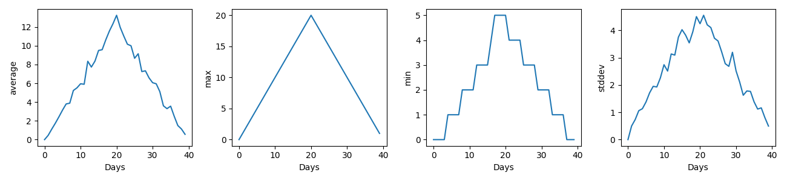

## Inflam


Inflam is a command line tool that generates basic statistical plots for clinical trial inflammation data.

Key features:

- **Supports inflammation clinical trial data in CSV** (comma-separated value) format
- **Generates a PNG image plot for basic statistical measures**, with mean, minimum, maximum, and standard deviation currently supported
- **Supports batch generation of plots** on multiple input inflammation datasets
- **Based on Python, Numpy and Matplotlib**, it's highly portable across platforms

### Prerequisites

Inflam has been developed and tested on the following:

- Python 3.11
- Numpy 1.24.1
- Matplotlib 3.6.2

For running the unit tests:

- Pytest 7.2.0

### Installation

First obtain the contents of this repository:

```shell
git clone https://github.com/steve-crouch/readme-example
cd readme-example
```

Then set up a Python virtual environment and install Inflam's prerequisites into that environment:

```shell
python3 -m venv venv
source venv/bin/activate
pip install -r requirements.txt
```

### Getting Started

To run Inflam over a single inflammation dataset file, and output the generated plot to a particular directory:

```shell
./inflam.py data/input/inflammation-01.csv --outputdir data/output
```

Once  you've run this command, you should see the following in the inflammation-01.png file in the data/output directory:



You can also specify an arbitrary number of inflammation datasets, e.g.:

```shell
./inflam.py data/input/inflammation-01.csv data/input/inflammation-02.csv --outputdir data/output
```

### Running the Tests

To run the unit tests written using the pytest framework, ensure you have the prerequisites installed (see above), then do:

```shell
python -m pytest tests/test_models.py
```

### Authors

- [Steve Crouch](https://github.com/steve-crouch)
- A.N.Other
- S.Omebody Else

### Licence

This software is licensed under the [MIT Licence](LICENSE.md).
